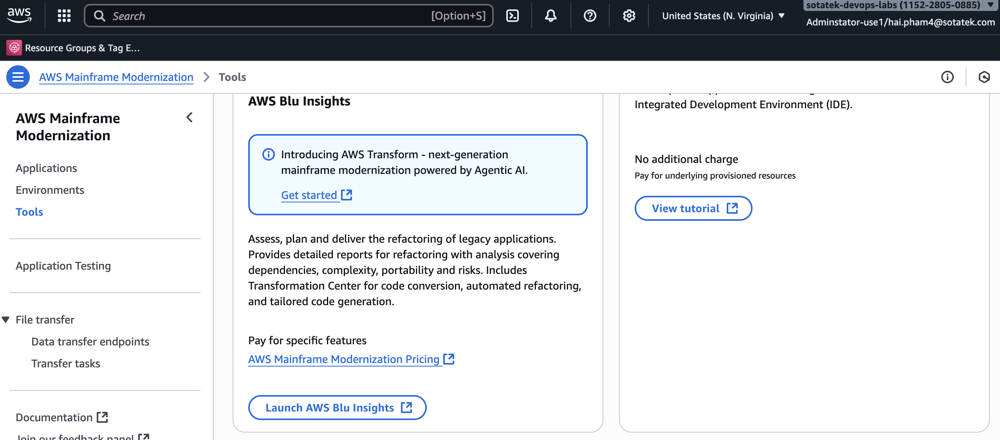
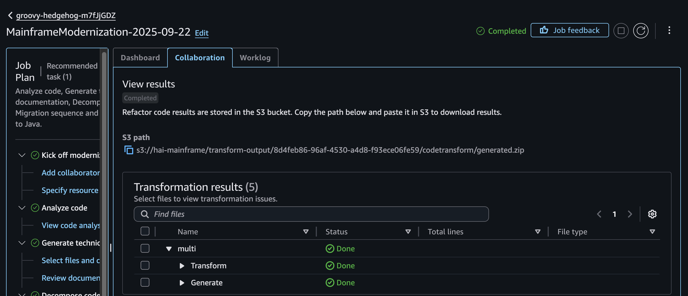

# PlanetsDemo — Modernization and Deployment Guide

A concise guide to transform legacy code to modern Java and deploy it on AWS Mainframe Modernization (M2). This includes an overview of AWS Blu Insights and AWS Transform, plus automated deployment using Terraform and a Makefile.

## Table of Contents

- [Overview](#overview)
- [Refactor Code](#refactor-code)
  - [AWS Blu Insights](#aws-blu-insights)
  - [AWS Transform](#aws-transform)
    - [Prerequisites](#prerequisites)
    - [Use AWS Transform to Refactor Code](#use-aws-transform-to-refactor-code)
      - [Step 1: Create a workspace](#step-1-create-a-workspace)
      - [Step 2: Create a refactoring job](#step-2-create-a-refactoring-job)
      - [Upload source code](#upload-source-code)
      - [Analyze source code](#analyze-source-code)
      - [Generate documentation](#generate-documentation)
      - [Refine or decompose code](#refine-or-decompose-code)
      - [Refactor code](#refactor-code-1)
  - [Current Limitations with AWS Transform](#current-limitations-with-aws-transform)
- [Deploy Built Modern Java Code](#deploy-built-modern-java-code)
  - [Prerequisites](#prerequisites-1)
  - [What’s Being Deployed](#whats-being-deployed)
  - [Configure Variables](#configure-variables)
  - [Build and Deploy with Makefile](#build-and-deploy-with-makefile)
  - [Access the Application](#access-the-application)
  - [Destroy and Clean](#destroy-and-clean)
  - [Tips](#tips)

## Overview

- Legacy source code must be transformed into modern Java before deployment.
- After modernization, you can deploy to AWS Mainframe Modernization (M2) or any Java runtime (e.g., ECS, Kubernetes).
- AWS provides two key tools for transformation: AWS Transform and AWS Blu Insights.

## Refactor Code

### AWS Blu Insights

- Go to AWS Mainframe Modernization → Tools → AWS Blu Insights → Launch AWS Blu Insights.



- You must register with the Blu Insights team, provide details, and wait for approval.
- After approval, you will see a dashboard:


- Key areas:
  - Codebase: Create and manage refactoring projects.
  - To-dos: Track tasks for each project.
  - Version Manager
  - Secured Spaces
  - Transformation Center

- Limitations:
  - Many features are locked initially. You must complete courses and obtain certifications for full access.
  - Certification details: https://bluinsights.aws/certification

- For this demo, Blu Insights is not used further.

### AWS Transform

#### Prerequisites

- Enable AWS IAM Identity Center in your account.
- Add users from Identity Center to AWS Transform.
- Assign the AWS Transform application to users/groups so they can sign in (via AWS Organization SSO).


#### Use AWS Transform to Refactor Code

##### Step 1: Create a workspace

- On the dashboard, go to Settings → Create workspace.


##### Step 2: Create a refactoring job

- Click “Create a job.”


##### Upload source code

- Upload your legacy source code to Amazon S3.
- In the “Specific source” step, provide the S3 URI under “Assets to modernize.”


- Proceed to the next step.

##### Analyze source code

- AWS Transform analyzes your uploaded code and lists processed files on the dashboard.


##### Generate documentation

- Generate summary and/or detailed documentation for your codebase.


- Example documentation output:


##### Refine or decompose code

- Group files into “domains” (use cases/layers) to make refactoring easier.

You might structure it like this:


##### Refactor code

- AWS generates Java-based code and pushes artifacts to your working S3 bucket.



- The `<app-name>-pom` directory contains your Java source code that can be deployed with AWS M2.


### Current Limitations with AWS Transform

- AWS Transform supports specific Java versions (primarily Java 17). Some dependencies in refactored projects are private and require Blu Insights tooling.
- Release notes: https://docs.aws.amazon.com/m2/latest/userguide/ba-release-notes.html
- Example: the dependency `com.netfective.bluage` in `pom.xml` is private. Building the refactored project requires access to the Blu Insights toolchain (often requires L3 certification). See the Blu Insights section.


- Due to these constraints, building entirely outside Blu Insights may be blocked.

## Deploy Built Modern Java Code

This section explains how to deploy the sample Java artifacts using Terraform and a Makefile. It uses the sources in `labs/1.PlanetsDemo/terraform/PlanetsDemo-v1/`.

### Prerequisites

- Terraform (>= 1.5)
- AWS CLI configured with credentials and an optional `profile`
- AWS account with Mainframe Modernization (M2) enabled in your target `region`
- Existing VPC and at least two subnets in different Availability Zones
- Permissions to manage M2, S3, and EC2 networking (security groups)

### What’s Being Deployed

- `PlanetsDemo-v1/` is zipped into `PlanetsDemo-v1.zip`.
- An S3 bucket is created, and the ZIP is uploaded.
- An M2 Environment and M2 Application are created.
- Application version 1 is deployed.
- A security group opens TCP `8196` (default `port`) to the internet and allows intra-VPC traffic. The environment is `publicly_accessible = true`.

### Configure Variables

Create or edit `labs/1.PlanetsDemo/terraform/terraform.tfvars`:

```hcl
region         = "us-east-1"
profile        = null            # or "your-aws-profile"
name           = "terraform-m2-demo-planet"
engine_type    = "bluage"
engine_version = "3.9.0"
instance_type  = "M2.m5.large"

vpc_id     = "vpc-xxxxxxxxxxxxxxxxx"
vpc_cidr   = "10.0.0.0/16"       # must match your VPC
subnet_ids = [
  "subnet-aaaaaaaaaaaaaaaaa",
  "subnet-bbbbbbbbbbbbbbbbb"
]

port = "8196"
```

Notes:
- The S3 bucket name is `<name>-<region>-<account_id>` with versioning enabled.
- The application definition is templated from `application-definition.json` and references your S3 bucket and `port`.

### Build and Deploy with Makefile

From the Terraform directory:

```bash
cd labs/1.PlanetsDemo/terraform

# 1) Zip the source and generate a Terraform plan
make plan_planet

# 2) Apply the plan (creates S3 bucket, uploads ZIP, provisions M2 env/app, and deploys)
make deploy_planet
```

### Access the Application

- Terraform outputs `application_url`, for example:
  `http://<lb-dns-name>:8196/PlanetsDemo-web-1.0.0/`

You can print outputs at any time:

```bash
terraform output
```

### Destroy and Clean

```bash
# Destroy all Terraform-managed resources
make destroy_planet

# Remove local ZIP and then destroy
make clean
```

### Tips

- If you change the contents of `PlanetsDemo-v1/`, re-run:
  `make plan_planet` (this re-zips the source and re-plans).